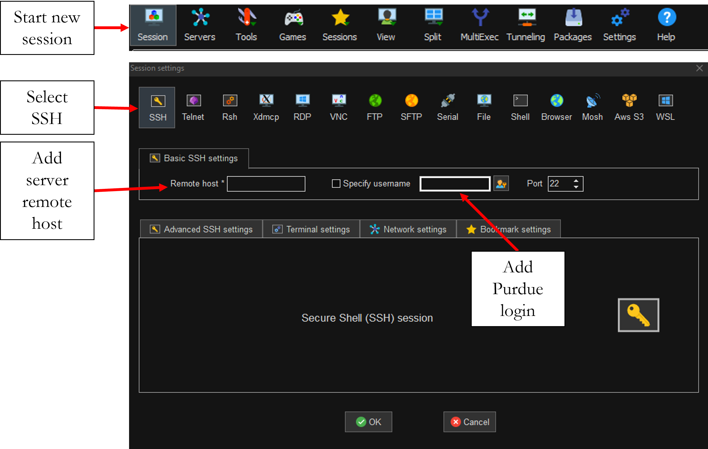

# Basic commands and Files to run jobs on a SLURM server

+   ABAQUS_PYTHON_RUN.sh        ->  Bash file to run Abaqus jobs with python scripts
+   ABAQUS_INP_RUN.sh        	->  Bash file to run Abaqus jobs with .inp files
+   ABAQUS_Array_Submission     ->  Bash file to run Parallel Abaqus job with SLURM array submission

## Install enhanced terminal

First install enhanced terminal for Windows with X11 server, tabbed SSH client, we recommend MobaXterm, but you can also use PuTTY:

+ [Visual Studio Code](https://code.visualstudio.com)
+ [MobaXterm](https://mobaxterm.mobatek.net/download-home-edition.html)
+ [PuTTY](https://www.putty.org/)

### Remote Hosts (MobaXterm)

+ Bell     -> bell-fe05.rcac.purdue.edu
+ Halstead -> halstead-fe00.rcac.purdue.edu
+ Brown    -> brown-fe01.rcac.purdue.edu

You can also access the server online using the following links (Remote Desktop):

+ [Bell](https://www.rcac.purdue.edu/compute/bell)
+ [Halstead](https://www.rcac.purdue.edu/compute/halstead)
+ [Brown](https://www.rcac.purdue.edu/compute/brown)

## Running Commands

+ Run bash File                                            -> sbatch FILE_NAME.sh
+ Cancel Job (Job ID can be found using "squeue -u $USER") -> scancel JOBID 
 
## Load Module

+ module load "module name" (intel, abaqus/2021 , mathematica, matlab)
+ module list

## Create anaconda enviroment (python package installation)

+ module load anaconda/5.1.0-py36
+ conda-env-mod create -n mypackages

### Load Enviroment

+ module load use.own
+ module load conda-env/mypackages-py3.6.4

## General information commands

+ Show the number of available cpus                 ->  qlist
+ Show the available storage                 		->  myquota
+ Show all jobs running under "aarrieta" account    ->  squeue -A aarrieta
+ Show all jobs running under user account    		->  squeue -u $USER

## Check ABAQUS Tokens

ml bioinfo lmstat

lmstat -a -c 1736@mooring.ecn.purdue.edu 

lmstat -f abaqus -c 1736@mooring.ecn.purdue.edu | grep -iE "ARRIETA|aarrieta|hwang125|riley104|dmboston|jrivaspa|thakkara|chan160|rojas23|osorio2|caddis|morga263|kboddapa|sadeghs|liang287|yki"

IF YOU ARE NOT ON THE LIST, PLEASE ADD YOURSELF